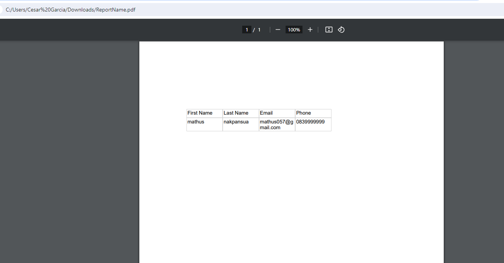

# NetCoreReportePorRDLC

## Version NetCore 2.1
Es muy diferente de hacer en la version 2.1 y la version 6.

## Creditos al video https://www.youtube.com/watch?v=k481DGaC3v4

Hay que instalar Microsoft.RdlcDesigner para poder visualizar el reporte y modificar sus dimensiones